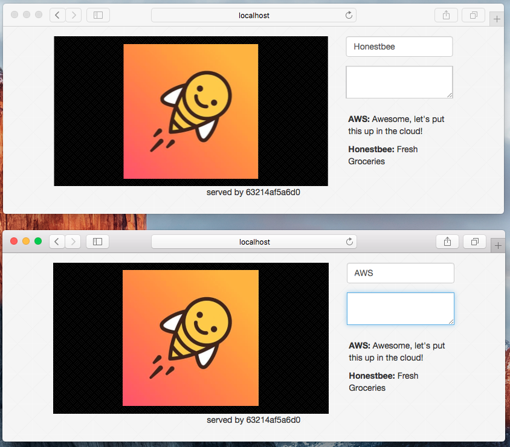

## Overview

In this sample Repo we will use Docker to quickly and easily get started with and scale a Real-Time messaging app written in Golang.



As a reference, a very lightweight app from the [Toptal: Going Real-Time with Redis Pub/Sub](https://www.toptal.com/go/going-real-time-with-redis-pubsub) article was used. The code has slightly been modified to better demonstrate Docker related concepts and is fully included in this repository.

Changes to the original application:

- Added additional logging
- Added indicator which application container is serving the client
- Added [exponential back-off](https://medium.com/@kelseyhightower/12-fractured-apps-1080c73d481c#.zbqpolxwo) as a best practice for applications running in the cloud.

The application allows users to upload images and see real time comments on those images. Clicking the image will show indicators where the image was clicked for every user. All this functionality was written by the Toptal developer.

To implement the above functionality, the following stack will be used:

- AWS S3: To store the user-uploaded images.
- MongoDB: As a Document Oriented Database keeping track of images stored on S3 and the comments of users.
- Redis Pub/Sub: Redis as a Publish/Subscribe messaging system to propagate real time updates
- App: the Golang application to serve the webpage and manage the websockets with client browsers
- Nginx: As a load balancer to easily scale the application horizontally.

**Note**: Nginx is used as a load balancer while running the full stack locally, in a production environment a more robust load balancer setup should be considered.


Development environment:

 - Tested on OSX El Capitan with Bash
 - Install [Docker For Mac](https://beta.docker.com/)
 - Ensure you have a working AWS Account (we will do sample S3 setup as part of these instructions)
 - Download [jq](https://github.com/stedolan/jq/releases) to easily work with AWS resources from the CLI

## Table of Contents:

 - [Setting up S3](#setting-up-s3) : Set up all necessary objects on AWS using the CLI.
 - [Getting to know Docker for Mac](#getting-to-know-docker-for-mac): Ensuring Docker is working as expected.
 - [Getting to know Redis](#getting-to-know-redis): Using Docker to play with Redis - no installs required!
 - [Getting to know MongoDB](#getting-to-know-mongodb): Using Docker to play with MongoDB - no installs required!
 - [Playing with the full application stack](#playing-with-the-full-application-stack): `git clone` + `make` + `docker-compose` to stand up the full app locally.
 - [ECS Introduction](#ECS-introduction): High level overview of ECS (To be completed)
 - [Deploying to ECS](#deploying-to-ecs): Using AWS CLI to deploy full app to ECS (To be completed)

## Setting up S3

Install AWS-CLI (You will need access keys to use the cli)
```
pip install awscli
aws configure
```

Ensure jq is working properly:
```console
jq --version
```

Expected Output (similar to this):
```console
jq-1.5
```

Create an account to give S3 access to the Application (Don't use root account)
```console
aws iam create-user --user-name sample_app
```

Create Access Key and save to `.env` file:
```console
aws iam create-access-key --user-name sample_app | jq -r '"AWS_ACCESS_KEY_ID=\(.AccessKey.AccessKeyId)","AWS_SECRET_ACCESS_KEY=\(.AccessKey.SecretAccessKey)"' >> .env
```

Create S3 Bucket (You will need to change instructions according to your bucket name, samples here use `ecs-sample`)
```console
aws s3 mb s3://ecs-sample --region ap-southeast-1
```

Add your S3 bucket name to your `.env` file:
```console
echo "S3_BUCKET_NAME=ecs-sample" >> .env
```

Create Policy Document for S3 Bucket
```console
cat - << EOF > SampleAppS3Policy.json
{
    "Version": "2012-10-17",
    "Statement": [
        {
            "Effect": "Allow",
            "Action": "s3:*",
            "Resource": [
                "arn:aws:s3:::ecs-sample/",
                "arn:aws:s3:::ecs-sample/*"
            ]
        }
    ]
}
EOF
```

Upload Policy Document
```console
policy_arn=`aws iam create-policy --policy-name MyAppS3Access --description "Give S3 Access to ecs-sample bucket" --policy-document file://SampleAppS3Policy.json | jq -r '.Policy.Arn'`
```

Attach Policy Document to `sample_app` user
```console
aws iam attach-user-policy --user-name sample_app --policy-arn $policy_arn
```

**Note**: CloudFormation should be considered to automate the above steps.

## Getting to know Docker for Mac

Once Docker for Mac has been installed and is running, confirm everything is installed correctly:

```console
docker version
```

Expected output (similar to this)
```console
Client:
 Version:      1.11.2
 API version:  1.23
 Go version:   go1.5.4
 Git commit:   b9f10c9
 Built:        Wed Jun  1 21:20:08 2016
 OS/Arch:      darwin/amd64

Server:
 Version:      1.11.2
 API version:  1.23
 Go version:   go1.5.4
 Git commit:   56888bf
 Built:        Mon Jun  6 23:57:32 2016
 OS/Arch:      linux/amd64
```

```console
docker-compose version
```

Expected output (similar to this)
```console
docker-compose version 1.7.1, build 0a9ab35
docker-py version: 1.8.1
CPython version: 2.7.9
OpenSSL version: OpenSSL 1.0.1j 15 Oct 2014
```

docker "Hello world!"

```console
docker run hello-world
```

Expected output:
```console
...
a9d36faac0fe: Pull complete
Digest: sha256:e52be8ffeeb1f374f440893189cd32f44cb166650e7ab185fa7735b7dc48d619
Status: Downloaded newer image for hello-world:latest

Hello from Docker.
This message shows that your installation appears to be working correctly.

To generate this message, Docker took the following steps:
 1. The Docker client contacted the Docker daemon.
 2. The Docker daemon pulled the "hello-world" image from the Docker Hub.
 3. The Docker daemon created a new container from that image which runs the
    executable that produces the output you are currently reading.
 4. The Docker daemon streamed that output to the Docker client, which sent it
    to your terminal.

To try something more ambitious, you can run an Ubuntu container with:
 $ docker run -it ubuntu bash

Share images, automate workflows, and more with a free Docker Hub account:
 https://hub.docker.com

For more examples and ideas, visit:
 https://docs.docker.com/engine/userguide/
```

At this point, you may read the [userguide](https://docs.docker.com/engine/userguide/) linked above. Concepts will be explained as they are encountered in this guide as well.

## Getting to know Redis

Once Docker is installed, you will never have to install packages on your machine to play with interesting technology again. You can simple run the service in a container and remove every trace of it when done.

First, lets spin up a Daemonized (`-d`) redis container (named `redis-test`):
```console
docker run -d --name redis-test redis:3.2.0-alpine
```

Verify the container is running:
```console
docker ps
```

To play with this redis, we need the `redis-cli`, but we do not need to install it on our machine as `redis-cli` is bundled in the redis container!

Get a shell (`-it`) in a 2nd redis container linked (`--link`) to the first:
```console
docker run -it --rm --link redis-test redis:3.2.0-alpine /bin/sh
```

From within this container, connect to redis server (`-h redis-test`):
```console
redis-cli -h redis-test
```

Test Redis
```console
SET lives 9
INCR lives
GET lives
```

Let's play with Pub/Sub features of Redis:
```console
SUBSCRIBE channel
```

Launch a 2nd redis container (re-use the exact same command to launch the container from above in a separate terminal)
```console
redis-cli -h redis-test
```

Publish data from 2nd container to `channel`
```console
PUBLISH channel "hello from container2"
```

You should see the message broadcasted to all subscribed clients. Notice that once a connection is in subscription mode, you can no longer use it to send messages on. To both send and receive, 2 separate connections to the redis server are required.

## Getting to know MongoDB

Very similar to the Redis experiment above, quickly launch a MongoDB server:

Launch a Daemonised Mongo container:
```console
docker run -d --name mongo-test mongo:3.2.6
```

Launch a container to play with the mongo shell:
```console
docker run -it --rm --link mongo-test mongo:3.2.6 /bin/bash
```

Connect via Mongo shell
```console
mongo mongo-test:27017
```

Insert sample documents
```javascript
db.messages.insert(
{
    "message": "hello",
    "sender": "me"
})

db.messages.insert(
{
    "message": "world",
    "sender":"you"
})
```

Select sample messages
```javascript
db.messages.find()
```

Select sample messages with a conditions document
```javsacript
db.messages.find( { "sender": "you" })
```

Create an ascending index on `sender` field of the messages collection
```javascript
db.messages.createIndex({"sender": 1})
```

## Playing with the full application stack

The application is written in Golang. all dependencies have been vendored in with `Godeps`. However, to play with the application, golang does not have to be installed locally. Everything is handled through Docker.

Let's first clean up the `redis-test` and `mongo-test` containers:
```console
docker stop redis-test mongo-test && docker rm redis-test mongo-test
```

Clone the application:
```console
git clone https://github.com/so0k/ecs-sample.git
```

**Note**: Once you are required to develop further, setting up a local golang environment and cloning the application under the correct path is still easy and possible.

Build the application (using Docker)
```console
make
```
**Note**: This makefile is inspired by [Nicola Paolucci's article](https://developer.atlassian.com/blog/2015/07/osx-static-golang-binaries-with-docker/).

The full application stack is defined in a declarative [docker-compose.yaml](docker-compose.yaml) file at the root of this repository.

The Environment configuration for our application is stored in the `.env` file we have incrementally been creating in the above setup steps. Docker Compose will pass all these parameters from the `.env` file to our application via ENVIRONMENT VARIABLES.

Two parameters are still missing, add these as follows:
```console
echo "MONGO_URL=mongodb://mongo/ecs-sample" >> .env
echo "REDIS_URL=redis://redis" >> .env
```
*Note*: We have defined the MongoDB hostname as `mongo` and the Redis hostname as `redis` in the docker-compose file.

Let's `watch` running containers with the following command in a separate terminal:
```console
watch -n 1 "docker ps --format='table{{.Image}}\t{{.Names}}\t{{.Status}}\t{{.Ports}}\t{{.ID}}'"
```

We are now ready to stand up the application stack:
```console
docker-compose up -d
```

Once all containers are running, you should be able to open [localhost:80](http://localhost:80/)

Try to scale the application:
```console
docker-compose scale app=5
```

Opening multiple browsers should demonstrate that client sessions are load balanced to separate application servers behind the load balancers and that all real-time events are propagated across the cluster.

Get a shell on one of the running application containers:
```console
docker exec -it ecssample_app_1 /bin/sh
```

Review the DNS records published by the Docker Engine:
```console
nslookup apps
```

We can ping `mongo` and `redis` hosts from app container:
```console
ping mongo
ping redis
```

Our `mongo` and `redis` containers are isolated from the load balancer:

Get a shell on the running load balancer.
```console
docker exec -it lb /bin/sh
```

We can ping apps:
```console
ping apps
```

We can not ping `mongo` or `redis` hosts
```console
ping mongo
ping redis
```

Clean up
```console
docker-compose stop
docker-compose rm
```

Notes:

- The application uses DNS round robin for the nginx load balancer to test scaling locally
- A `so0k/ecs-sample:dev` container is available to play with the application source code

Run the Dev container as follows:
```console
docker run -it --name ecs-sample-dev -v $PWD:/go/src/github.com/so0k/ecs-sample so0k/ecs-sample:dev
```

## ECS Introduction

High level overview of ECS - To be completed.

## Deploying to ECS

Using AWS CLI to deploy full app to ECS - To be completed.

## Conclusion

Docker really simplified getting started with a new technology stack with minimum setup of the local machine required.

AWS ECS provides a robust infrastructure to run Docker Containers at scale in production.

Images built are minimal and share layers where possible

Image Sizes:
```
REPOSITORY          TAG                 CREATED             SIZE
ecssample_lb        latest              2 hours ago         182.8 MB
so0k/ecs-sample     dev                 2 hours ago         821.6 MB
so0k/ecs-sample     1.0.0               3 hours ago         14.33 MB
redis               3.2.0-alpine        7 days ago          29.07 MB
mongo               3.2.6               3 weeks ago         313.1 MB
```
